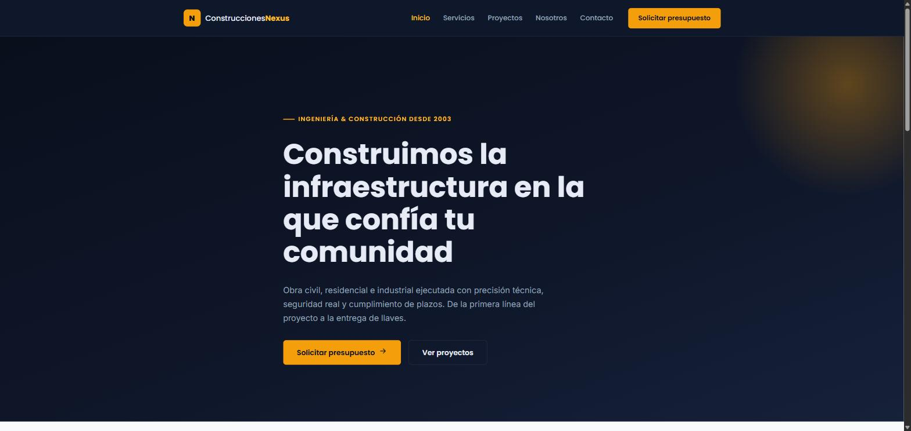

# 🏗️ Angular AWS Static Hosting


Plantilla reutilizable para desplegar aplicaciones Angular en AWS de
forma segura, escalable y con distribución global de contenido, usando
**Terraform** como Infraestructura como Código.

Incluye una app Angular de ejemplo completa la landing de una empresa
ficticia de construcción.



---

## 📦 Qué incluye

- ☁️ **Infraestructura Terraform modular** — S3, CloudFront, ACM y Route 53.
- 🅰️ **App Angular de ejemplo** completa y desacoplada de la infraestructura, lista para sustituir.
- 🔐 **Buenas prácticas de seguridad**: bucket privado, OAC, TLS forzado, cabeceras de seguridad.
- 🔁 **CI/CD con GitHub Actions + OIDC** — build, `terraform apply`, sync a S3 e invalidación de CloudFront, sin credenciales estáticas.
- 🧩 **Backend remoto de Terraform** (S3 + DynamoDB) aislado en su propio paso de bootstrap.
- 🤖 **Dependabot** configurado para npm, Terraform y GitHub Actions.

---

## 🗺️ Arquitectura

```
Cliente → Route 53 (DNS) → CloudFront (CDN + HTTPS) → S3 privado (contenido Angular)
                                    ↑
                        ACM (certificado SSL/TLS, us-east-1)
```

| Servicio | Función |
|---|---|
| 🌐 **Route 53** | Gestión del dominio y resolución DNS, registro Alias hacia CloudFront |
| 🚀 **CloudFront** | CDN global, cacheo en Edge Locations, terminación SSL/TLS, único punto de entrada al contenido |
| 🔒 **ACM** | Emisión y validación (vía DNS) del certificado SSL usado por CloudFront |
| 🪣 **S3** | Almacenamiento del build estático de Angular, bucket completamente privado |

### Seguridad por defecto

- 🛡️ S3 con Block Public Access, versioning, cifrado SSE-S3 y acceso exclusivo a través de **OAC**
- 🔐 CloudFront con redirección forzada HTTP → HTTPS, TLS y cabeceras de seguridad (HSTS, `X-Content-Type-Options`, `X-Frame-Options`, `Referrer-Policy`, CSP)
- 🧭 Errores 403/404 redirigidos a `/index.html` (200) para el enrutamiento del lado del cliente de Angular
- 🔑 Certificado validado por DNS, automatizado por Terraform
- 🗄️ Remote state de Terraform en S3 con locking en DynamoDB


---

## 📁 Estructura del repositorio

```
angular-aws-static-hosting/
├── infrastructure/          # 🌍 Terraform: módulos, entornos y bootstrap del backend remoto
│   ├── bootstrap/
│   ├── environments/prod/
│   └── modules/
│       ├── s3-static-site/
│       ├── cloudfront/
│       ├── acm-certificate/
│       ├── route53/
│       └── github-oidc/
├── app/                       # 🅰️ Aplicación Angular de ejemplo (sustituible)
├── .github/
│   ├── workflows/deploy.yml    # 🔁 CI/CD: build + terraform apply + deploy + invalidación
│   └── dependabot.yml          # 🤖 Actualización automática de dependencias
└── LICENSE
```

`infrastructure/` y `app/` están completamente desacopladas: puedes eliminar
el contenido de `app/` y poner tu propia aplicación Angular sin tocar Terraform.
Ver [`app/README.md`](app/README.md) para el detalle de cómo hacerlo.

> **Estado actual:** la app Angular de ejemplo (`app/`), los módulos de
> Terraform (`infrastructure/`) y el workflow de CI/CD
> (`.github/workflows/deploy.yml`) ya están completos.

---

## 🚀 Cómo desplegar

1. **Bootstrap del backend remoto** — crea el bucket S3 y la tabla DynamoDB para el state de Terraform (`infrastructure/bootstrap`).
2. **Desplegar infraestructura** — `terraform init / plan / apply` sobre `infrastructure/environments/prod`.
3. **Build de la app** — `npm ci && npm run build` dentro de `app/`.
4. **Sync a S3 e invalidación de CloudFront** — manual o a través del workflow de GitHub Actions.

Instrucciones detalladas paso a paso en [`infrastructure/README.md`](infrastructure/README.md).

---

## 🧱 Stack

**Infraestructura:** Terraform · AWS (S3, CloudFront, ACM, Route 53, DynamoDB)
**App de ejemplo:** Angular 22 · TypeScript · SCSS
**CI/CD:** GitHub Actions · OIDC (sin credenciales estáticas)

---

## 📫 Más información

- [`app/README.md`](app/README.md) — la app Angular de ejemplo y cómo sustituirla por la tuya.
- [`infrastructure/README.md`](infrastructure/README.md) — despliegue paso a paso de la infraestructura.
